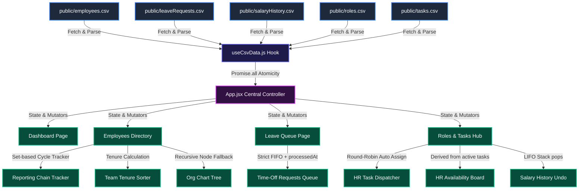

# ⚡ HRPulse Workspace

<div align="center">
  
  
  
  
</div>

<br />

**HRPulse Workspace** is a high-fidelity, interactive React portal designed for HR professionals to manage the employee lifecycle. The system is engineered to be lightweight, fast, and secure—loading operational data directly from physical CSV assets and dynamically deriving operational state (like availability) on-the-fly to guarantee perfect data integrity.

---

## 🗺️ Architectural Data Flow

The diagram below shows how the application ingests CSV data and propagates updates across pages and components:



---

## ✨ Core Features

*   **📂 CSV-Driven Data Pipeline**: Fetches and parses 5 local CSV files asynchronously using `PapaParse` inside a custom hook, managing state atomically via `Promise.all`.
*   **🌳 Collapsible Org Chart Tree**: Recursively renders employee nodes based on `managerId`. If circular references occur, it gracefully renders warnings. If no roots are detected naturally, it falls back to the first employee as root.
*   **🔗 Reporting Chain Tracker**: Instantly builds the path of managers up to the CEO for any employee. Uses a `visited` Set to guarantee instant cycle detection.
*   **⚖️ LIFO Salary Rollback**: Tracks salary modifications chronologically, offering a global LIFO (Last-In-First-Out) stack Undo button to revert the latest change safely.
*   **⏱️ FIFO Leave Queue**: Enforces First-In-First-Out leave requests processing (only the front-of-queue item can be processed) and records the exact processing date (`processedAt`).
*   **📋 Round-Robin Task Assignor**: Assigns administrative tasks sequentially to available HR personnel, dynamically looking up employee names to keep data consistent.
*   **💎 Premium Aesthetics**: Styled with a dark-slate theme featuring responsive layouts, custom scrollable directory containers (no pagination), micro-animations, and status badges.

---

## 🚀 Getting Started

### Prerequisites

*   **Node.js** (v18 or higher recommended)
*   **npm** (or yarn)

### Installation

1.  Clone the repository and navigate to the project directory:
    ```bash
    git clone git@github.com:Samarth-ITM/HRpulse-Workspace.git
    cd HRpulse-Workspace
    ```
2.  Install dependencies:
    ```bash
    npm install
    ```

### Running Locally

To start the Vite local development server:
```bash
npm run dev
```
Open `http://localhost:5173` in your browser.

### Building for Production

To compile production assets into `/dist`:
```bash
npm run build
```
